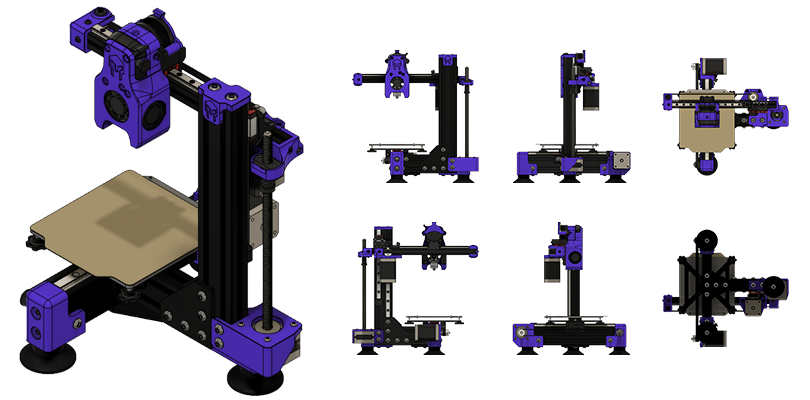

# Teensy

### This project is still under development!

The Teensy is a microscale cantilever 3D printer with a build volume just big enough to print most things without taking up valuable desk space. If you like small printers, this is the next printer for you!

This printer can be run on 24V using the recommended BTT SKR Mini E3 v3, or it can be run on 12V using an old trusty Ramps 1.4. Either way, it will perform great. It's really up to you which direction you want to go.

## Features
- Build Size: 100mm x 100mm x 100mm
- Footprint: 280mm x 260mm x 320mm
- Net Weight: 2.7kg (6 lbs.)
- Extrusion Type: Direct Drive / Reverse Bowden
- Bed Leveling: Manual for 12V version, Inductive Probe for 24V version
- Firmware: Klipper (*recommended*), will also run Marlin

### To Do List
As this is still a work in progress, there are several things still left to do:
- Cable Managment
- Design new print head assembly to allow for a inductive probe
- Enclosure

## Build Tips
The only file that needs supports is the X Idler Mount. All other files do not need supports.

There are 2 versions of the Y Carriage to choose from. 
1. **12v Y Carriage** - Use this if you are going to reuse a RepRap PCB heated bed
2. **24v Y Carriage** - Use this if you are going to source your own MIC6 heat bed plate

There are 2 versions of the Bed Plate to choose from. 
1. **Bed Plate** - This is the recommended bed plate for the 24v Y Carriage
2. **Bed Plate with stops** - This is version has two M2 threaded holes in the rear to help align the flex plate quickly. UNTESTED! Use at your own risk.

Warming! Not all 2040 rails are made the same. If you source 2040 rails that have holes too large for M5 screws, please use the STLs in the "M6_Rails" folder, as they are designed for the larger M6 screw size. The length of the screw will remain the same.

### BOM
The BOM is currently under development and will be released here once finished.

## User Mods
Once the community around this printer grows, I'm sure there will be several users modding it. Those user mods will be located in the [Mods](https://github.com/armourcraft/Teensy/tree/main/Mods) directory.

## Contributers
If you would like to contribute to the development of this project, please let me know. I'm no perfessional engineer, so I could use all the help I can get.

## License & Copywrite
The above information is provided under GNU GPLv3. More information can be found in the License file.
Copywrite © 2021 Corey Blake, Armour Craft LLC